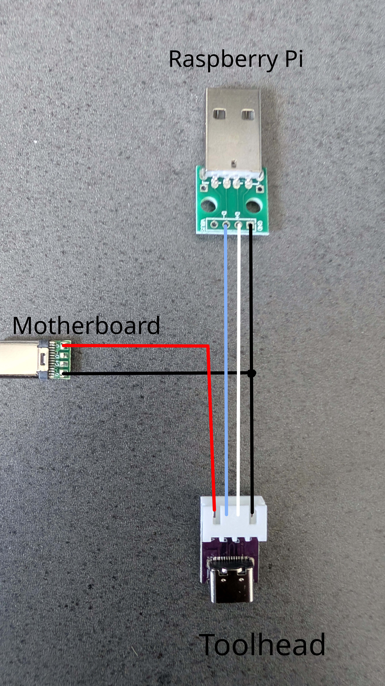
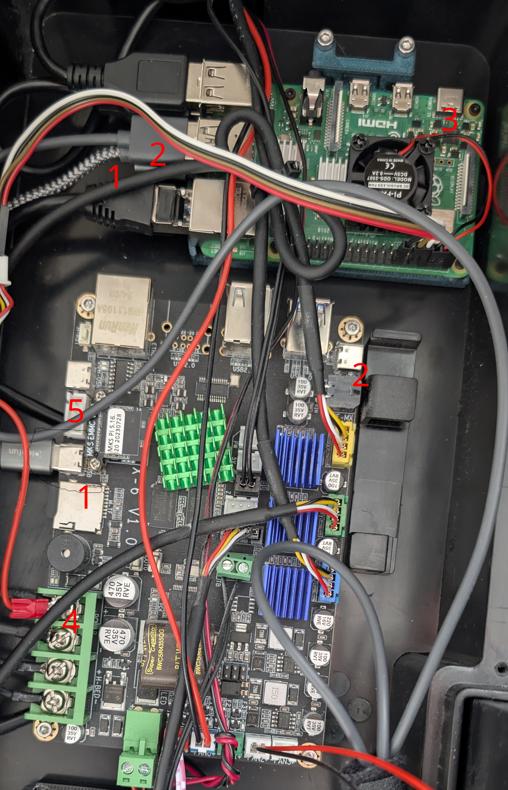
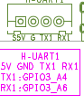
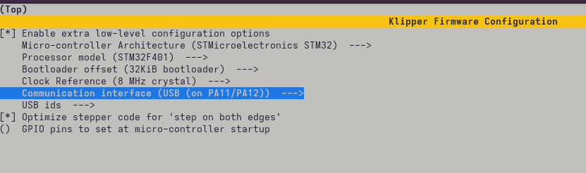
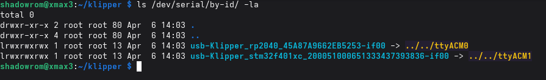

# X-Max3-Pi4B-Mod
A simple mod for the Qidi X-Max 3 to run on a Rasperry Pi 4B instead of the weak RK3328 SoC

# DISCLAIMER
This is a simple mod, for people with knowledge about electronics. Do not try this if you're uncertain of your skills in this area!

This project is provided "as is", without any express or implied warranty, including without limitation any warranty of merchantability, fitness for a particular purpose, or non-infringement. By following these instructions or using any files in this repository, you accept full responsibility for the work and all associated risks. I will not be liable for any damage to your printer, Raspberry Pi, other hardware, property, data, or for any other loss resulting from the use of this mod.

## Prerequisites
You need:
- A X-Max 3 Printer with a X-6 V1.0 Motherboard
- A Raspberry Pi 4B with a micro SD card for the OS (>=32GB)
- 2 USB-A to USB-C cables of approximately 30-50cm length one angled by 90°
- A Step down power converter 24V -> 5V 3A [like this for example](https://www.berrybase.de/netzteilmodul-6-40v-5v-3a-mit-2x-usb-ausgang)
- 1 female USB C breakout board
- 1 male USB A breakout board
- 2 male USB C breakout board
- Some cables (0.5mm² e.g.: red, black, white, blue)
- 2 cable shoes (ring or the open variant)
- 4 Breadboard connection cables (as short as possible) female to male for the serial port connection to the stock screen
- A second micro SD Card (8-32GB) to flash the mainboard

## Preparations

### Printed parts
- Print the Pi4 Holder in the STL folder and mount your Raspberry Pi4 to it. Or design your own...

### Cables and electronics

You need a Y-Cable for the toolhead connection. Because the toolhead operates with 24V, this would turn your Raspberry Pi into a beautiful smoke machine.
So grab the USB breakout boards and build one:

### Installation

- Install Rasbian on your Pi, use a version without GUI
- Backup your system
- Shut down and remove the power connector
- Open the back plate
- Remove the EMMC from the mainboard and store it in a safe location
- Remove the USB and Ethernet cables from the Motherboard
- Remove the USB C cable for the toolhead (Number 2 in the image below)
- Unplug the serial cable for the screen (Number 5 in the image below)
- Mount the Pi to the screw point
- Wire up the PI, plug Ethernet and USB Cables into the Pi

- Connect the Pi to the Mainboard MCU via USB A to USB C cable (Number 1 in the above image)
- Connect the Y-Cable to your PI and your Mainboard (Number 2 in image) connect the USB C cable from the toolhead to the Y-Connector
- Connect your Step down power converter to the 24V input on the motherboard (4). Use appropriate cable shoes for this.
- Plug a USB-Cable into the step down converter and connect it to the Pi (3). You'll need a short USB connector or one that is angled by 90° because of limited space
- Connect the breadboard connectors to the serial port of the Raspberry Pi see [this tutorial](https://randomnerdtutorials.com/raspberry-pi-pinout-gpios/) Pin 4 (VCC), Pin 6 (GND), Pin 8 (TX) and Pin 10 (RX)
- Connect the male side of the breadboard connectors to the serial port cable for the screen. Connect the pins 1 on 1 (VCC to VCC, GND to GND, RX to RX, TX to TX)

### Software
- Boot up the system
- Enable the serial port using raspi-config (Terminal no, activate yes)
- Install Klipper, Moonraker, Mainsail, Crowsnest and other software 
- Build klipper firmware for the Mainboard MCU with these settings:

- Copy the klipper.bin to your second micro SD and rename it to X_4.bin
- Shut down the printer
- Insert the SD card to the SD Slot on the X-6 mainboard
- Start the printer
- Now you should see two devices in /dev/serial/by-id/ one is the THR the other is the Motherboard

- Install FreeDi to make the screen work [FreeDi](https://github.com/Phil1988/FreeDi). When prompted if you're using the stock mainboard, chose no!
- Edit the FreeDi.cfg and set the Serial Port to /dev/ttyS0
- Reboot the system and complete the FreeDi wizard, this will add a base config for the printer
- Edit printer.cfg and change the serial port of the MCU to the new serial port
- Crowsnest won't work after FreeDi setup, you'll have to reconfigure it